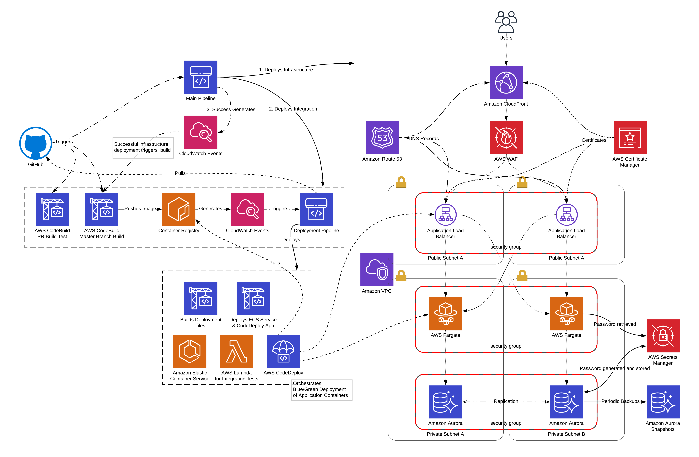
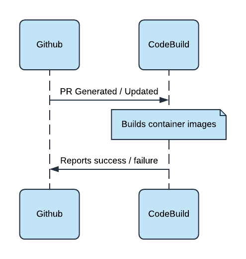
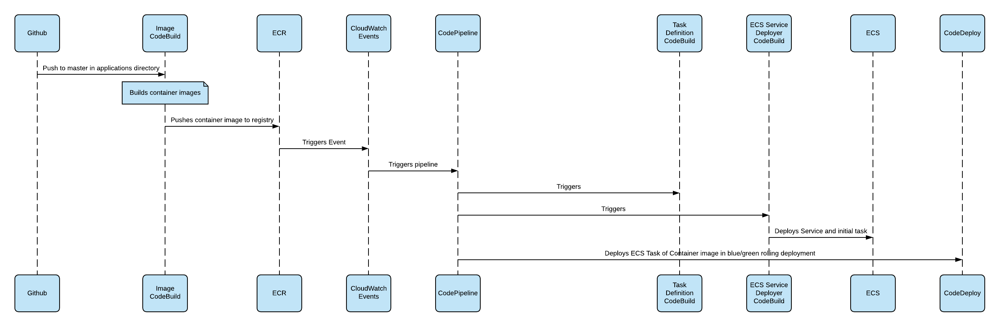

# Example: AWS Cloudformation-based 3-Tier Web App on ECS Fargate
This is an example of a 3-Tier Web App architecture running on Amazon Web Services ECS Fargate written in Cloudformation and using CodePipeline and CodeBuild as deployment tools. The design includes examples of how to use CDN, WAF, Application Load Balancing, Private Networking, Secrets Management, Databases and deployment tools on AWS.

## Architecture

The architecture follows a standard three-tier web app design made up of the following AWS components:
  - [Amazon Cloudfront](https://aws.amazon.com/cloudfront/)
  - [AWS WAF](https://aws.amazon.com/waf/)
  - [Amazon Route 53](https://aws.amazon.com/route53/)
  - [AWS Certificate Manager](https://aws.amazon.com/certificate-manager/)
  - [Application Load Balancer](https://aws.amazon.com/elasticloadbalancing/)
  - [Amazon VPC](https://aws.amazon.com/vpc/)
  - [AWS Fargate](https://aws.amazon.com/fargate/)
  - [AWS CodeBuild](https://aws.amazon.com/codebuild/)
  - [AWS CodeDeploy](https://aws.amazon.com/codedeploy/)
  - [AWS CodePipeline](https://aws.amazon.com/codepipeline/)
  - [AWS Secrets Manager](https://aws.amazon.com/secrets-manager/)
  - [Amazon Aurora - Postgres](https://aws.amazon.com/rds/aurora/)



## Setup

### Step 1: Create a Template Configuration file
Configuration files are located in `deployment/config`. These are Cloudformation [Template Configuration](https://docs.aws.amazon.com/AWSCloudFormation/latest/UserGuide/continuous-delivery-codepipeline-cfn-artifacts.html#w2ab1c13c15c15) files, which allow for Parameter values, stack tagging and stack policies.

The `pipeline.json` file is required and allows all configurable parameters to be stored as code. This file requires a few things to have already been put in place:

  1. A Public Hosted Zone Domain configured in Route 53. This is excluded so you can sort out your own Domain Registration, however there is an example to deploy a Public Hosted Zone in `deployment/prereq/domain.yml`. Relevant parameters:
      - **PublicTLD**: _The domain name_
      - **PublicTLDHostedZoneId**: _The Hosted Zone ID_

```json
{
  "Parameters" : {
    "StackPrefix": "a-prefix-for-your-resource-names",
    "PublicTLD": "a.public.domain.example.com from Route 53",
    "PublicTLDHostedZoneId": "the Route 53hosted zone ID of that public domain name",
    "ALBSubdomain": "a random subdomain for the ALB e.g. 'alb-214dba6'",
    "AppContainerCount": "Number of application containers to run",
    "AppContainerPort": "Port that the container application runs on",
    "AppCPU": "CPU units to allocate to container (1024 == 1 logical CPU)",
    "AppMemoryMB": "RAM to allocate to container in Megabytes",
    "AppLogRetention": "Days to keep application logs in CloudWatch",
    "SampleAppSubdomain": "a subdomain for the app URL e.g. 'sampleapp'",
    "PrivateTLD": "a random private TLB to use eg 'myprivatedns'",
    "DBRetention": "a retention period in days to keep database snapshots"
  }
}
```

Additionally, any Cloudformation Action in the Pipeline could be extended to make use of its own Template Configuration file.

### Step 2: Cloudfront N. Virginia (us-east-1) requirement
**If you plan on deploying the entire stack in us-east-1 you can skip this step**

Because [Cloudfront requires the use of the us-east-1 region when using HTTPS between viewers and the CDN](https://docs.aws.amazon.com/AmazonCloudfront/latest/DeveloperGuide/cnames-and-https-requirements.html), this deployment requires that we use us-east-1 at least partially.

Because of this, if you want to deploy the stack into a different region than us-east-1, CodePipeline requires an additional S3 Bucket to be deployed there, to cater for deploying Cloudfront. To overcome this dependency `deployment/prereq/deploy-bucket.sh` is supplied to deploy a Bucket into us-east-1.

Run the bucket deployment script first before continuing if you are using any region other than us-east-1.

```
Usage: deploy-bucket.sh <StackPrefix> <AWSProfile>
 - StackPrefix: A prefix to use for namespacing resources
 - AWSProfile: Optional. The name of an AWS CLI profile to use
 ```

**Make sure the StackPrefix matches the StackPrefix in `pipeline.json` in Step 1**

### Step 3: Deploy CodePipeline
Because Cloudformation [Template Configuration](https://docs.aws.amazon.com/AWSCloudFormation/latest/UserGuide/continuous-delivery-codepipeline-cfn-artifacts.html#w2ab1c13c15c15) files are limited to use only via CodePipeline, the file created in Step 1 is only used for subsequent continuous deployment of the stack.

To deploy the Pipeline the first time:
 1. Jump into the [Cloudformation Console](https://console.aws.amazon.com/cloudformation/home).
 2. Click **Create Stack**.
 3. Upload the `deployment/pipeline.yml` template.
 4. Complete the Parameters section using the values from Step 1.
 5. Click through, adding any tags as desired and [acknowledging IAM resource creation](https://docs.aws.amazon.com/AWSCloudFormation/latest/UserGuide/using-iam-template.html#using-iam-capabilities).
 6. The rest of the deployment is automated and will be visible in the [CodePipeline Console](https://console.aws.amazon.com/codesuite/codepipeline/pipelines).

## Continuous Integration

CI is handled using CodeBuild and CodePipeline.
  1. CodeBuild is webhooked from Github when a PR is submitted or edited.
  2. This kicks off a process to build a new image. Unit tests could be easily added to this step as well, or you can handle those separately in Github Actions.
  3. CodeBuild webhooks back to Github to inform the status of the build.



## Continuous Deployment

CD is handled using CodeBuild, CodePipeline and CodeDeploy.
  1. Github webhooks CodeBuild when a change is made in the `master` branch in either of the application folders.
  2. CodeBuild then runs a build of the Docker image.
  3. If successful, CodeBuild then pushes the image to ECR.
  4. A CloudWatch Event is triggered from the new image arriving in ECR.
  5. This CloudWatch Event triggers the CodePipeline designed for deployments.
  6. CodePipeline triggers CodeBuild for building deployment dependencies, like the Task Definitions with new image versions.
  7. CodePipeline calls CodeDeploy to deploy the ECS Tasks to Fargate in a Blue/Green deployment. Integration tests can be added at this step using AWS Lambda.
  8. To allow for zero-downtime deployments, CodeDeploy runs the tasks in a test route for successful health-checks before cutting traffic over the new containers.



## Security
Security is applied in a defense-in-depth approach. Internet facing services are protected by AWS WAF, with protections in place to prevent well-known attacks, hotlinking, and accessing the Distribution or Load Balancer from their default AWS-given addresses.

Within the architecture, IAM is applied in a best-practice approach, avoiding excessive wildcard policies wherever possible. Access to relevant AWS Resources e.g. Secrets Manager is contained to only the access required, by the Principals that require it.

Network access is controlled to prevent unexpected exposure between applications and the database. The applications running in AWS Fargate and the database running in RDS are both deployed within a private subnet, without a NAT gateway. To access AWS APIs there are endpoints deployed for only the services that are required. The Load Balancers are deployed in a public subnet.

### WAF Configuration
AWS WAF is configured on Cloudfront as well as the Application Load Balancer. The rules are designed to accomplish the following:
  - ALB is not accessible without the PublicTLD in the Host header. This prevents:
      - Accessing Cloudfront with the default domain given by AWS.
      - Accessing the ALB with the default domain given by AWS.
  - A basic security rule is configured. This prevents:
      - SQL Injection (SQLi) style attacks in the Query String.
      - Cross-site Scripting (XSS) style attacks in the Query String.
      - Large requests. The request body is limited to 512 bytes. The request query string is limited to 16 bytes.
  - If the Referer request header exists it is evaluated. This prevents:
      - Content being embedded without using HTTPS.
      - Content being hotlinked from sites other than the chosen domain.

## Operations

### Application Containers
To manage the containers running for an application you can use the AWS CLI as follows:

#### Scaling:
`aws --region <your-region> ecs --service <service-name> --desired-count <number>`

You can use this command to completely stop a service by reducing the container count to 0.

#### Deployments
Although deployments are handled manually via the continuous delivery pipeline mentioned above, you can force a new deployment like so:

`aws --region <your-region> ecs --service <service-name> --force-new-deployment`
